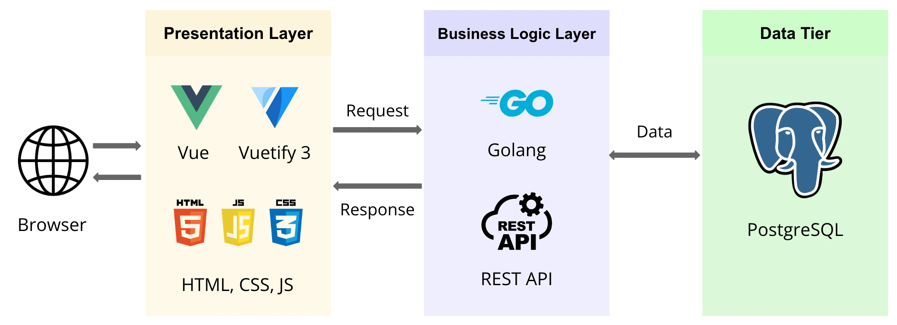
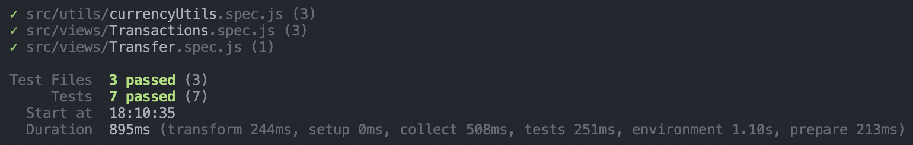

# Introduction

- Creating a Mobile Wallet as a Software Engineer that provides mobile wallet as a service.

## 3 - Tier Architecture

- **Frontend**: VueJS/Vuetify.
- **Backend**: Golang API.
- **Database**: PostgreSQL.

## Assumptions

- Beneficiaries are users of the application. Added an `IsInternal` field for future use to allow external funds transfer to recipients outside of MobileWallet2023 (could be another financial institution or mobile wallet provider).
- User can have multiple beneficiaries.
- User must be linked to the beneficiary. (Can create a CreateBeneficiary endpoint in future to link the user to beneficiary)
- Funds transfer was performed by mobile number of the beneficiary.
- Transaction date and received date is instantaneous with no delay.
- Hardcoded the currency exchange for funds transfer. (In reality, as quotations are created, the currency conversion fluctuates with the FX market. Need to call an external API in future to monitor real time currency changes).
- Minimum and maximum amount allowed for transferring funds is 10 and 10000 respectively.

## User Stories

- User Stories (taken from Product Backlog into Spring Backlog)
  - As a user, I want to be able to select a beneficiary so that I can send funds to them easily.
  - As a user, I want to view a list of my transactions so that I can keep track of my financial transaction history.
  - As a user, I want to be prevented and notified from spending over my account balance to avoid overdrawing.

## Key Features

- Utilized **SQL Transaction** for transferring funds because it involves UPDATE and INSERT queries. This is to ensure that the transaction is an atomic operation and if any operation fails, the entire transaction is rolled back to maintain data consistency and integrity, otherwise, the transaction is committed.
- Implemented **Context Timeout** in Golang Backend API for requests for 2 minutes (configurable). This allows for better control of request operations and the API will terminate requests that exceed the specified timeout, preventing these request from affecting the entire application's performance.
- Implemented custom error types for `ServiceError`, `RepositoryError` and `UnauthorizedError` to differentiate between different error types and returning the valid http status.
- Created a docker volume in `docker-compose` to prevent the container from using the `node_modules` in the local environment with packages of _darwin-arm64 arch_. Inside the container, it is a Linux system that requires packages for _linux-arm64_. The docker container has its own node_modules configured to the Linux environment.
- Every request must be sent with a request 'Authorization' Header with the key 'Bearer <JWT_Token>' to be authorized to access resources.
- Added `sql.NullString`, `sql.NullInt64`, and `sql.NullFloat64` for GET requests to retrieve nullable values from database (if any). There could be data patches with NULL values and by doing so, Golang can handle the nullable values.

## SQL Tables

1. `users`: storing user details, including mobile number
2. `user_balance`: maps the user_id of `users` table with the balance, currency and country iso code.
3. `beneficiaries`: stores beneficiary details, including mobile number. (similar number of rows as `users` table currently but will be adding external beneficiaries in future).
4. `user_beneficiary`: maps the `user_id` of the user and the `beneficiary_id` of the beneficiary. To determine which user is linked to the beneficiary.
5. `transactions`: stores the transactions made by the sender to the recipient.

## Sprint 1 Endpoints

| Method | Endpoints        | Description                                                 | Purpose                                                                                      |
| ------ | ---------------- | ----------------------------------------------------------- | -------------------------------------------------------------------------------------------- |
| GET    | `/user`          | Get the details of the logged in user.                      | To display the current balance and other details of the user.                                |
| GET    | `/beneficiaries` | Get a list of beneficiaries.                                | To display the beneficiaries linked to the user in the dropdown menu for the user to select. |
| GET    | `/transactions`  | Get a list of transactions.                                 | To display to the user the transaction history.                                              |
| POST   | `/transaction`   | Creates a transaction between the user and the beneficiary. | Transfer funds to the specified beneficiary.                                                 |

## Backend Unit Testing (`transactions.go`)

- 3 steps to Unit Testing: Arrange, Act, Assert (**Design Pattern**)
  - Arrange: Preparing test data (inserting into the respective tables to be tested).
  - Act: Calling the actual implementation and getting the actual result.
  - Assert: Asserting that the actual data returned is equal to the expected data.
- Code to check coverage
  - `cd ~/mobile-wallet-provider-golang-vue-postgresql/api/internal/handlers`
  - `alias coverage='go test -coverprofile=coverage.out && go tool cover -html=coverage.out'`
  - `coverage`
  - `cd ~/mobile-wallet-provider-golang-vue-postgresql/api/internal/transactions`

| Layer      | File Name              | % Coverage |
| ---------- | ---------------------- | ---------- |
| Controller | `transactions_test.go` | 62.5%      |
| Service    | `service_test.go`      | 79.4%      |
| Repository | `repo_test.go`         | 76.7%      |

## Frontend Unit Testing

- Using `vitest` for unit test performance optimization as it uses Vite in the background.
- `npm i --save-dev vitest --force`: save as a dev dependency. (used `--force` flag as there was a clash with the current dependencies, faced the same issue for Jest).
- Code to run test
  - `cd ~/mobile-wallet-provider-golang-vue-postgresql/web`
  - `npm test`

| Layer | File Name               | Test Cases |
| ----- | ----------------------- | ---------- |
| View  | `Transactions.spec.js`  | 3/3 Passed |
| View  | `Transfer.spec.js`      | 1/1 Passed |
| Utils | `currencyUtils.spec.js` | 3/3 Passed |

