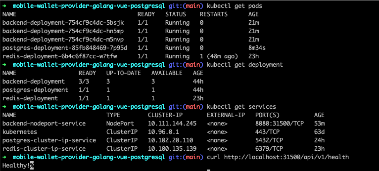
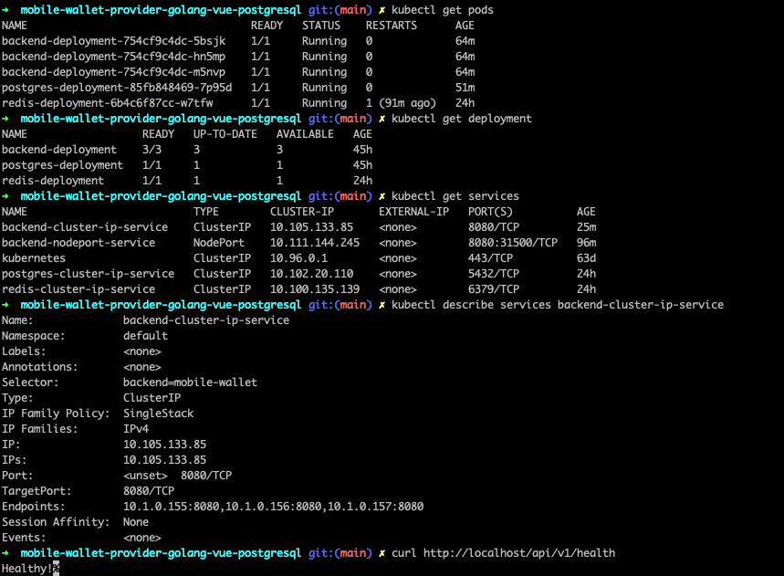

# Kubernetes

- Running k8s locally (single node) with Docker Desktop Kubernetes

## Pushing images to Docker Registry (Docker Hub)

```
cd server
docker login -u <username>
docker build -t lowjiewei/mobile-wallet-be:v1.1 .
docker push lowjiewei/mobile-wallet-be:v1.1
```

## Commands to setup k8s cluster

```
kubectl apply -f ./k8s/
```

## Creating secrets in k8s cluster

- Creating secrets in kubernetes cluster is an **imperative** command. I have created one to store Postgres Password.

```
kubectl create secret generic pgpassword --from-literal PGPASSWORD=verystrongpassword
kubectl create secret generic pguser --from-literal PGUSER=postgres
kubectl create secret generic pghost --from-literal PGHOST=postgres-cluster-ip-service
kubectl create secret generic pgdb --from-literal PGDB=postgres
kubectl create secret generic redishost --from-literal REDISHOST=redis-cluster-ip-service

kubectl get secrets
NAME         TYPE     DATA   AGE
pgpassword   Opaque   1      18s
```

## Testing with NodePort



## Ingress Service (Production Environment)

- `kubectl apply -f https://raw.githubusercontent.com/kubernetes/ingress-nginx/controller-v1.8.2/deploy/static/provider/cloud/deploy.yaml`

```
➜  mobile-wallet-provider-golang-vue-postgresql git:(main) ✗ kubectl get pods -n ingress-nginx
NAME                                        READY   STATUS      RESTARTS   AGE
ingress-nginx-admission-create-p9n98        0/1     Completed   0          3m38s
ingress-nginx-admission-patch-kv4v7         0/1     Completed   0          3m38s
ingress-nginx-controller-68fb8cf9cc-jthrd   1/1     Running     0          3m38s
```

## Using Ingress Service with NGINX Controller

- Use Ingress Service instead of NodePort service in Production environment.
- Ingress Service exposes a set of services to the outside world and it is the most popular web server.
  - NGINX Ingress
- Ingress Controller
  - `kubectl apply -f https://raw.githubusercontent.com/kubernetes/ingress-nginx/controller-v1.8.2/deploy/static/provider/cloud/deploy.yaml`
  - Controller is any type of object that constantly works to make some desired state a reality inside of the Kubernetes Cluster.
  - Ingress Controller looks at our current state and compares it with the desired state (Ingress Config - routing rules), then it tries to make it a reality to produce the new state.
  - The Ingress resource is just a configuration object (defined in `ingress-service.yaml`), and it **needs an Ingress Controller to implement the routing rules** defined in the Ingress resource.
  - When you apply an Ingress resource to your k8s cluster, the Ingress Controller (if configured and running in k8s cluster) watches for changes to Ingress resources and ensures that the routing rules specified in those resources are applied correctly to incoming traffic.


