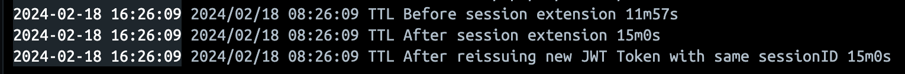

# Golang Clean Architecture

- [Example 1](https://github.com/Ikhlashmulya/golang-clean-architecture/)
- [amitshekhariitbhu](https://github.com/amitshekhariitbhu/go-backend-clean-architecture)
- [bxcodec](https://github.com/bxcodec/go-clean-arch)

## Clean Architecture Folder Structure

```
server
├── Dockerfile
├── README.md
├── cmd
│   └── api
│       └── main.go
├── config
│   └── development.yaml
├── delivery
│   └── http
│       └── handler
│           └── auth_handler.go
├── domain
│   └── user.go
├── dto
│   └── auth.go
├── exception
│   ├── error_user.go
│   ├── errors.go
│   └── response
│       └── messages.go
├── go.mod
├── go.sum
├── infrastructure
│   ├── config.go
│   └── database.go
├── init-db.sql
├── repository
│   └── user_repository.go
├── tests
├── usecase
│   └── auth_usecase.go
└── utils
    └── json_response.go
```

## Folder Structure Explanation

- **cmd**: Contains the main application entry point (`main.go`) and any additional entry points.
- **config**: Holds configuration files for different environments (e.g., `development.yaml`).
- **delivery/http/handler**: Manages HTTP request handling, handling incoming requests for authentication in this case.
- **domain**: Defines the core domain entities and business logic, such as the `User` entity.
- **dto**: Contains Data Transfer Objects (DTOs) that define the data structures exchanged between layers.
- **exception**: Handles error management, including specific errors related to users and general error messages.
- **infrastructure**: Deals with infrastructure concerns, such as database and configuration setup.
- **repository**: Implements the repository pattern, providing a way to interact with data storage (e.g., database).
- **usecase**: Implements use cases or application-specific business logic, such as authentication use cases.
- **utils**: Houses utility functions or helper methods, like `json_response.go` for managing JSON responses.
- **init-db.sql**: Initialization script for setting up the database schema and initial data.
- **tests**: Reserved for test files, including unit tests and integration tests.
- **README.md**: Documentation file providing an overview of the project structure and usage.

## Endpoints

| Method | Endpoint                        | Description                                                                             | Completed |
| :----: | ------------------------------- | --------------------------------------------------------------------------------------- | :-------: |
|  POST  | `/api/v1/users/register`        | Register a new user with required information like email, password and personal details |    [X]    |
|  POST  | `/api/v1/users/login`           | Authenticate a user and generate an access token for authentication                     |    [X]    |
|  POST  | `/api/v1/users/logout`          | Invalidate the user's access token, logging them out                                    |    [X]    |
|  POST  | `/api/v1/wallet`                | Create a new wallet for a user                                                          |    [X]    |
|  GET   | `/api/v1/wallet/all`            | Retrieve all wallets for a user                                                         |    [X]    |
|  GET   | `/api/v1/wallet`                | Retrieve one wallet for a user                                                          |    [X]    |
|  PUT   | `/api/v1/wallet`                | Update balance amount for one wallet for a user                                         |    [X]    |
|  POST  | `/api/v1/balance/deposit`       | Deposit money into the user's wallet                                                    |    [X]    |
|  POST  | `/api/v1/balance/withdraw`      | Withdraw money from the user's wallet                                                   |    [X]    |
|  POST  | `/api/v1/beneficiary`           | Add a beneficiary                                                                       |    [X]    |
| PATCH  | `/api/v1/beneficiary`           | Soft delete a beneficiary                                                               |    [X]    |
|  GET   | `/api/v1/beneficiary`           | Get a beneficiary                                                                       |    [X]    |
|  GET   | `api/v1/beneficiaries`          | Get all beneficiaries                                                                   |    [X]    |
|  POST  | `/api/v1/transactions/transfer` | Transfer money between two user wallets                                                 |    [X]    | // TODO: Use SQL Transaction for this |
|  GET   | `/api/v1/transactions/history`  | Retrieve the transaction history for a user                                             |    [X]    |
|  GET   | `/api/v1/users/profile`         | Retrieve the user's profile information                                                 |    [ ]    |
|  PUT   | `/api/v1/users/profile`         | Update the user's profile information                                                   |    [ ]    |
|  PUT   | `/api/v1/users/password`        | Change the user's password                                                              |    [ ]    |
|  POST  | `/api/v1/token/refresh`         | Request a new access token using a refresh token                                        |    [ ]    |
|  POST  | `/api/v1/exchange`              | Allow users to exchange one currency for another                                        |    [ ]    |
|  POST  | `/api/v1/kyc`                   | Implement KYC processes for user verification                                           |    [ ]    |
| DELETE | `/api/v1/users/close`           | Close a user's account and deactivate the associated wallet                             |    [ ]    |

# Authentication

## User Authentication Flow

1. User Authentication
   - The user signs into the application using their credentials.
   - The server authenticates the user by querying the database.
2. Session Creation:
   - Upon successful authentication, the server generates a unique session ID (uuid).
   - The server stores the session data in the Redis cluster.
   - Simultaneously, the server creates a JWT session token that includes the session ID.
3. Token Delivery to Client
   - The server sends back the JWT Token to the client.
   - The token is typically included in the Authorization header or a secure Authorization cookie.
4. Subsequent Requests
   - When the client makes another API call, it includes the JWT Token in the request.
5. Token Validation:
   - Upon receiving the request, the server validates the JWT Token using the stored secret key.
   - If the validation is successful, the server extracts the session ID from the JWT Token.
6. Session Data Retrieval
   - Using the extracted session ID, the server retrieves the corresponding session data from Redis.
7. Response Handling
   - If the session is valid and the requested resource exists, the server responds with the requested resource.
   - If the session is invalid or the authentication fails, the server responds with a 401 Unauthorized error.

## Session Validation with JWT Token and Redis

---

### Server Side Flow with Redis

1. User login with the credentials.
2. If unsuccessful login, return HTTP Status 401 Unauthorized.
3. If successful login, generate JWT Access Token and Refresh Token. Generate a session ID (uuid) and store it in the JWT Token.
4. Store sessionID --> userID mapping in Redis using `SetEx` so we know this sessionID belongs to this userID.
   - When the user logs out, delete this sessionID to invalidate the session.
5. Store userID --> sessionID mapping in Redis Set using `SAdd` because the user can have multiple sessions on different devices.
   - If the user changes/resets password, clear all the sessions in the Redis Set to invalidate all the sessions and the user will be logged out of all devices.
6. Store sessionID --> sessionObject mapping in Redis using `Set`
   - When the user changes his preferences or has new roles assigned, this change will be reflected because the data is stored on the server side (Redis).
   - By storing the data on the server side instead of the JWT Token, we have full control over critical session data and nobody can tamper with it.
   - If the data is stored on JWT Token, and the user accesses the application on multiple devices, the data will become stale as the user makes changes on other devices.

---

### Checklist

- [x] In Login UseCase, add sessionID -> userID using `SetEx` and userID -> sessionID using Redis Set `SAdd`
- [x] In Logout UseCase, remove sessionID from Redis using `Del` and the sessionID in userID Set using `SRem`
- [ ] Remove all sessions when user reset password
- [x] Add checks in refresh endpoints to extend session expiration with `GetEx`
- [x] Add session expiration to sessions in Redis
- [ ] Set session object in Redis when user logs in instead of storing in JWT Token

---

### Logging TTL for Session Validation

- Logging TTL in Authentication Middleware
- Extended session expiry time on every request



---
